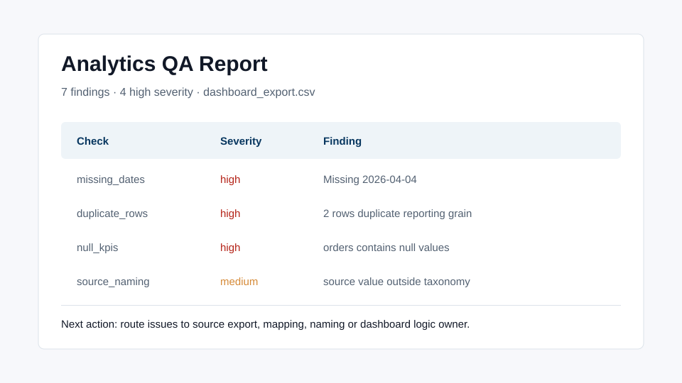

# Analytics QA Toolkit

Lightweight Python QA toolkit for checking dashboard exports before they reach stakeholders.

This project is built for analytics operations work: CSV/Excel files, dashboard extracts, marketing/eCommerce reporting, mapping tables and recurring manual QA. It is not a generic data science demo. It is a practical workflow a Data Analytics Project Manager can use to make reporting safer.

## Problem

Dashboards lose trust when source exports contain issues that are easy to miss:

- missing reporting dates
- null KPI values
- duplicate rows at the expected grain
- abnormal spikes
- country, brand or source values that do not match the approved mapping
- inconsistent campaign naming

## What It Does

Run the sample:

```bash
python scripts/run_qa.py \
  --input sample_data/dashboard_export.csv \
  --mapping sample_data/mapping_reference.csv \
  --config config/qa_config.json \
  --out reports/sample_qa_report.md
```

The report summarizes failed checks, warning counts, affected fields and practical next actions.

## Business Value

This helps teams move from “the dashboard looks wrong” to a clearer issue path:

- source file problem
- mapping problem
- tracking or naming problem
- dashboard logic problem
- stakeholder definition problem

That saves time, reduces repeated investigations and makes QA evidence reusable in tickets, handovers and monthly reporting documentation.

## Tech Stack

- Python
- pandas
- CSV/Excel inputs
- Markdown and CSV QA outputs
- pytest for core checks

## Project Structure

```text
analytics-qa-toolkit/
  config/qa_config.json
  sample_data/
  scripts/run_qa.py
  src/analytics_qa_toolkit/qa.py
  reports/sample_qa_report.md
  screenshots/report-preview.svg
  tests/test_qa.py
```

## Screenshots



## Why This Matters

Analytics QA is often treated as a manual habit instead of an operating process. This repo shows how a small repeatable tool can support dashboard governance, data quality investigations and stakeholder confidence without requiring a heavy platform.

## What I Would Improve Next

- Add Excel summary output for non-technical stakeholders.
- Add Streamlit upload UI.
- Add scheduled GitHub Actions examples.
- Add configurable severity thresholds by dashboard.
- Add richer UTM and campaign taxonomy validation.

## License

MIT
